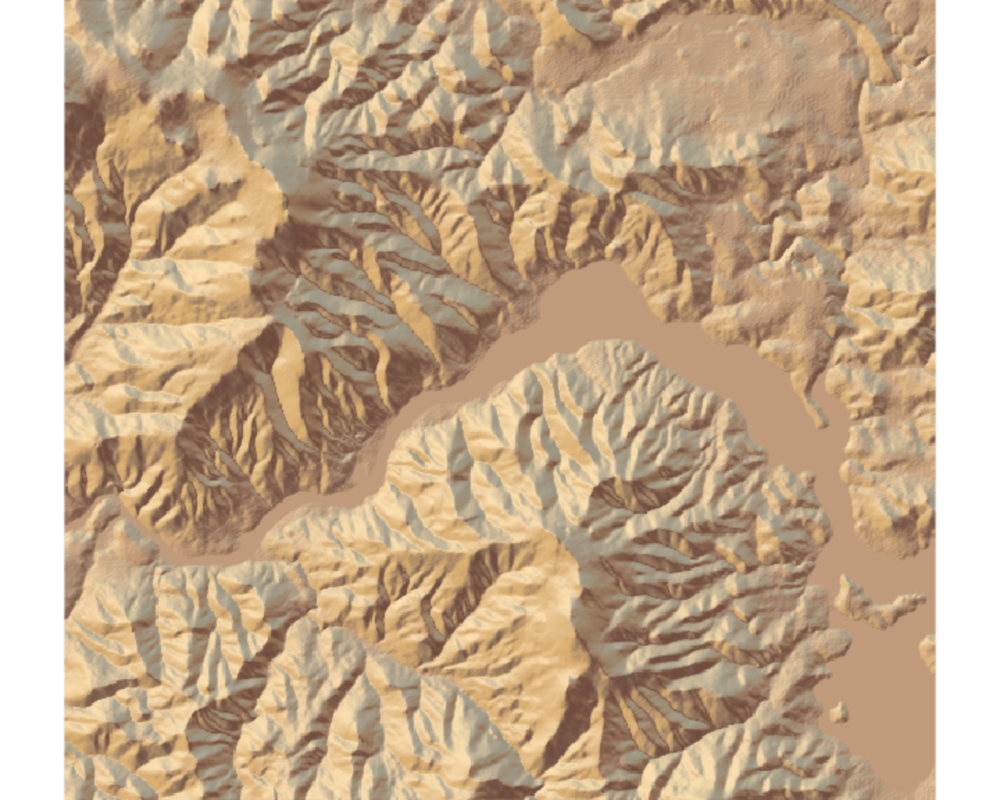

## Package Overview ##
Rayshader is a useful open source package that can help you with 3D data visualization and creating maps from data in R.  

### Why was this created? ###
The creator of this package, Tyler Morgan-Wall, was inspired by the Vatican Gallery of Maps and wanted to be able to created detailed, almost artistic maps in R.
Before we get to building up these 3D maps, let's first look at the underlying function: ray tracing. Ray tracing is a technique that traces the path of light and stimulates how it interacts with the virtual object, creating realistic lighting effects. The data starts out as evenly spaced square grids of elevation data at each point. A ray of light is then cast in a direction, and if it intercepts a surface, it reduces the light at that point. With multiple rays, a shadowing effect can be seen. The rays are propagated along multiple grid lines to interpolate a surface between four points, a technique known as bilinear interpolation.

### Version History ###
The package was released on August 2, 2020 as version **0.19.2**
The initial version of rayshader took an elevation matrix, traced lines towards a light source at each point, and subtracted light from that point and ran it into the ground. It had very few features to it at the time. An updated version implemented Lambertian reflectance into plot development, which involved determining the direction in which the surface is pointing and taking the dot product of that direction with the light vector. This helped account for the fact that surfaces that point towards light tend to be brighter. Another version implemented spherical texture mapping, which helps add texture to the maps by treating the object as a sphere and using angular displacement to map coordinates. 
An additional improvement involved utilizing the ambient occlusion model. Within the package, this entailed using additional ray-tracing to look at surface intersections and deduced the amount of sky present at that point. One final improvement included adding a water detection algorithm. 

### Usage/Dependency on Other Packages ###
Since the main purpose of Rayshader is 3D visualization of 2D graphs, this package is frequently used with the **ggplot2** package. Other packages such as raster, scales, and sp are used for loading and manipulating data, rescaling color channels, and transforming point coordinates, respectively.  Rayshader can also be installed using the **devtools** package; devtools simplifies the package developing process by providing R functions that encompass most of the common functions used by developers. There are also packages that were developed in response to Rayshader that supplement its capabilities. For example, the package **geoviz** adds gps tracers to rayshader scenes and simplifies elevation data prep. Some functions rely on packages such as **spacefillr**, **tibble**, **rgl**, **rgdal**, **raster** (for loading data), **sp**, and **scales**.

## Examples of Usage ##
```{r,include=FALSE,echo=FALSE}
# loading packages necessary
library(raster)
library(sp)
library(scales)
library(rayshader)
library(rgdal)
library(rgl)
library(tibble)
library(spacefillr)
library(rayrender)
library(ggplot2)
```

```{r,include=FALSE,echo=FALSE}
# load in data using raster funtion
data = raster("7966_75m.dem")
# convert raster into matrix
matrix = raster_to_matrix(data)
```


the **sphere_shade** function maps and RGB texture using spherical mapping. It has several palettes that can be used for the texture. 


 
In the picture, the package used "desert" to map a .tif file. However, we used the "bw" texture to map an image of the Crane Prairie Reservoir in Oregon. It was plotted using the **plot_map** function, which can plot a matrix or array of data. 
```{r,echo=FALSE}
# implement sphere_shade using the black and white texture
matrix %>%
  sphere_shade(texture = "bw") %>%
  plot_map()
```

sphere_shade can also shift the direction of the sun. Here, we shifted the sun angle to be 75 degrees and plotted it using the "desert" texture
```{r,echo=FALSE}
# implement sphere_shade using desert texture with the sun at an angle of 75 degrees
matrix %>%
  sphere_shade(sunangle = 75, texture = "desert") %>%
  plot_map()
```


The **detect_water** function uses a flood-fill algorithm to detect bodies of water. We use this function, along with the **add_water** function, to add bodies of water to our map. 


```{r,echo=FALSE}
# implement add_water and detect water, make the water unicorn-colored
matrix %>%
  sphere_shade(texture = "desert") %>%
  add_water(detect_water(matrix), color = "unicorn") %>%
  plot_map()
```


The **ray_shade** function uses user specified directions to calculate a shadow map for our matrix of data. It uses the dot product of the mean ray direction and surface normal to scale light intensity. Here, we input our matrix into ray
shade, and then we input that into the **add_shadow** function, which can combine shadow maps and scale them.


```{r,echo=FALSE}
# we will begin to add shadows by passing our matrix into the ray_shade function
# and pass those results into add_shadow
matrix %>%
  sphere_shade(texture = "desert") %>%
  add_water(detect_water(matrix), color = "desert") %>%
  add_shadow(ray_shade(matrix), 0.5) %>%
  plot_map()
```

The **ambient_shade** function helps make valleys darker than flat areas using the ambient occlusion model. Here, we incorporated it into the shadows.

```{r,echo=FALSE}
# add light differences for valleys/flat areas using ambient_shade. The
# results of ambient_shade will get passed into add_shadow
matrix %>%
  sphere_shade(texture = "desert") %>%
  add_water(detect_water(matrix), color = "desert") %>%
  add_shadow(ray_shade(matrix), 0.5) %>%
  add_shadow(ambient_shade(matrix), 0) %>%
  plot_map()
```

**plot_3d** creates a 3-D map based on the elevation matrix and shadow data. We transformed our plot of the Crane Prairie Reservoir in Oregon. We use the **render_highquality** function to display the map using more refined light transport methods. It is technically a part of the rayrender package, but is often used within rayshader.
```{r,echo=FALSE}
# here we develop our 3D map
library(webshot)
matrix %>%
  sphere_shade(texture = "desert") %>%
  add_water(detect_water(matrix), color = "desert") %>%
  add_shadow(ray_shade(matrix, zscale = 3), 0.5) %>%
  add_shadow(ambient_shade(matrix), 0) %>%
  plot_3d(matrix, zscale = 10, fov = 0, theta = 135, zoom = 0.75, phi = 45, windowsize = c(1000, 800)) # plot 3D function implementation
Sys.sleep(0.2)
render_highquality(samples=200, scale_text_size = 24,clear=TRUE)
# render_snapshot can also be used here, but we used render_highquality instead due to compatibility issues

```

Finally, we can display ggplots in 3D. Here, we take the mtcars dataset and plot mpg versus displacement.
```{r,echo=FALSE}
## make a ggplot using mtcars dataset
library(ggplot2)
mtplot = ggplot(mtcars) +
 geom_point(aes(x=mpg,y=disp,color=cyl)) +
 scale_color_continuous(limits=c(0,8))
plot_gg(mtplot, width=3.5, sunangle=225, preview = TRUE)
```

The **plot_gg** function will transform a ggplot2 function into a 3D graph. It takes in the color argument (in this case, the number of cylinders) and you can input the dimensions of the plot as well as the sun angle to transform the plot. We are displaying this using render_highquality() again. 
```{r,echo=FALSE}
# make our aforementioned mtcars plot into a 3D plot
plot_gg(mtplot, width=3.5, multicore = TRUE, windowsize = c(1400,866), sunangle=225,
       zoom = 0.60, phi = 30, theta = 45)
render_highquality(clear = TRUE)
```

## Similar Packages ##
**Rayrender** is another package developed by Tyler Morgan-Wall that uses ray-tracing techniques and an R API to render scenes. Although this package isn't used with rayshader, it operates on similar mechanics.
**plot3D** has functions for viewing 2/3D data. However, in rayshader, you can physically see mountains and geographical features, whereas plot3D mainly visualizes data as specific points. 

## Reflection ## 
**Pros** 
Overall, this package is really fascinating and provides a comprehensive way to represent topological data. Given a set of data, we think that the functions in this package do a fantastic job at translating it into a very real and detailed image. It is a great data visualization tool. 
One **con** with this package is that it really would not be useful in terms of understanding implications of topological data, it merely acts a visualization tool. ArcGIS is another tool that could be used to plot geospatial data as opposed to this package.  Additionally, there is no comprehensive documentation regarding how to obtain the topological data, which makes it more difficult to utilize this package. One suggestion we would propose would be to include functions that can access data from the USGS database in order to make the mapping process more automatic. 

## Sources ##
https://www.tylermw.com/a-step-by-step-guide-to-making-3d-maps-with-satellite-imagery-in-r/
  https://medium.com/@nathanaelsheehan/an-easy-way-to-make-impressive-topological-maps-with-rayshader-66b257dc1e02
  http://www.hilltop-analytics.com/2019/05/i-can-see-my-house-from-here-your-favourite-places-in-3d-with-r-rayshader-and-geoviz/
https://www.tylermw.com/making-beautiful-maps/
https://www.tylermw.com/throwing-shade/